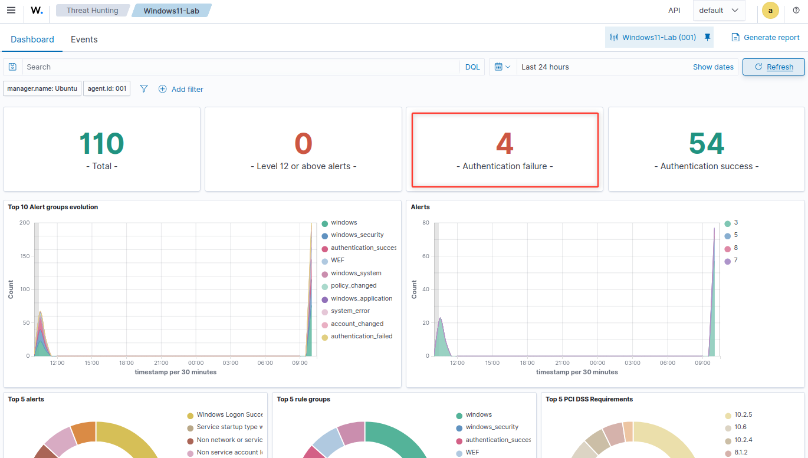
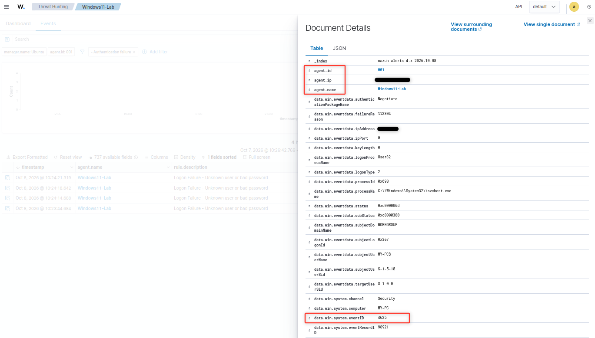
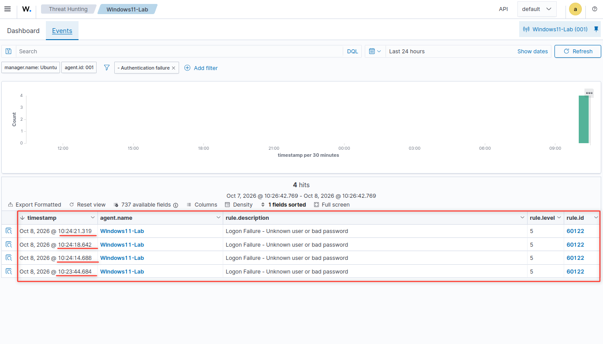
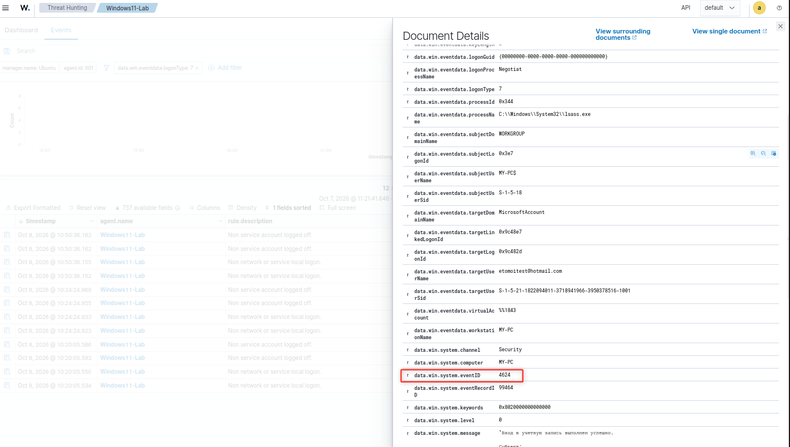

# Wazuh Security Log Investigation

### Overview

This project demonstrates a practical security log investigation using **Wazuh SIEM** and **Windows Security Event Logs**.

The investigation focuses on detecting and analyzing repeated failed authentication attempts on a Windows endpoint and determining whether the activity is consistent with normal user behavior or potentially suspicious authentication activity.

### Objective

The objectives of this investigation are to:

* Detect failed Windows authentication attempts using Wazuh.
* Analyze Windows Security Event ID `4625`.
* Identify the affected user account and source IP address.
* Build a timeline of authentication events.
* Correlate failed authentication attempts with a subsequent successful login.
* Assess whether the activity is likely to be a false positive or suspicious activity.
* Document the investigation and recommended SOC actions.

---

## Lab Environment

| Component      | Description                      |
| -------------- | -------------------------------- |
| SIEM           | Wazuh                            |
| Endpoint       | Windows 10                       |
| Virtualization | VirtualBox                       |
| Log Source     | Windows Security Event Logs      |
| Primary Event  | Event ID 4625 — Failed Logon     |
| Related Event  | Event ID 4624 — Successful Logon |

---

# Investigation Scenario

A Windows endpoint generated multiple failed authentication events.

The investigation was performed to answer the following questions:

1. Which user account was targeted?
2. Where did the authentication attempts originate?
3. How many failed attempts occurred?
4. When did the attempts occur?
5. What type of authentication was involved?
6. Was there a successful login after the failed attempts?
7. Does the activity indicate normal user behavior or potentially suspicious activity?

The authentication failures were intentionally generated in a controlled lab environment.

---

# 1. Detection

The investigation started in Wazuh by searching for Windows Security Event ID `4625`.

Event ID `4625` indicates that an account failed to log on.

Example search:

```text
data.win.system.eventID:4625
```

The resulting events provided the initial evidence that repeated authentication failures had occurred on the monitored Windows endpoint.

### Evidence



**Figure 1 — Wazuh detection of a failed Windows authentication attempt.**

---

# 2. Initial Event Analysis

After identifying the failed authentication event, the event details were examined to determine the context of the activity.

The investigation focused on the following fields:

* `eventID`
* `targetUserName`
* `ipAddress`
* `logonType`
* `timestamp`
* `failureReason`
* `status`
* `subStatus`

These fields help answer the basic SOC investigation questions:

**Who?**
Which account was targeted?

**Where?**
What source IP generated the authentication attempt?

**When?**
When did the event occur?

**What happened?**
Why did Windows reject the authentication attempt?

**How?**
What type of logon was attempted?

### Evidence



**Figure 2 — Detailed Windows Event ID 4625 information in Wazuh.**

---

# 3. Authentication Timeline

The next step was to examine multiple authentication failures rather than investigating a single event in isolation.

The events were reviewed chronologically to determine whether the failures represented a repeated pattern.

Example timeline:

```text
10:32:11 — Failed authentication
10:32:18 — Failed authentication
10:32:24 — Failed authentication
10:32:31 — Failed authentication
```

The following attributes were compared across the events:

* Target username
* Source IP address
* Windows host
* Timestamp
* Event ID
* Logon type

This allowed the individual log events to be analyzed as a single authentication sequence.

### Evidence



**Figure 3 — Timeline of repeated failed authentication attempts.**

---

# 4. Correlation With Successful Authentication

A critical part of the investigation was determining whether a successful authentication occurred after the failed attempts.

Windows Event ID `4624` was used to identify successful logons.

Example search:

```text
data.win.system.eventID:4624
```

The failed and successful authentication events were then compared.

Example sequence:

```text
4625 — Failed logon
4625 — Failed logon
4625 — Failed logon
4625 — Failed logon
4624 — Successful logon
```

The following attributes were compared between the events:

* Username
* Source IP
* Host
* Timestamp
* Logon type

A successful authentication following several failed attempts does **not by itself prove account compromise**. However, this sequence deserves additional investigation, particularly when the source, timing, or authentication context is unusual.

### Evidence



**Figure 4 — Failed authentication attempts followed by a successful authentication event.**

---

# Investigation Findings

The investigation established the following:

* Windows generated multiple failed authentication events.
* Wazuh successfully collected and displayed the events.
* Event ID `4625` was used to identify failed authentication.
* The affected user account was identified from the event data.
* The source IP address was identified.
* The authentication attempts were analyzed chronologically.
* A subsequent Event ID `4624` was investigated to determine whether successful authentication followed the failures.

The activity was therefore investigated as a **potentially suspicious authentication pattern**, rather than automatically classified as an attack.

---

# False Positive Assessment

Multiple failed login attempts do not necessarily indicate malicious activity.

Possible legitimate explanations include:

* A user entering an incorrect password.
* A user forgetting a password.
* An expired or recently changed password.
* Repeated authentication attempts from a legitimate workstation.

Additional indicators would increase the suspicion level:

* Unknown source IP address.
* Authentication attempts outside normal working hours.
* Multiple accounts targeted from the same source.
* Large numbers of authentication failures.
* Authentication attempts against privileged accounts.
* Successful authentication immediately following repeated failures.
* Other suspicious activity from the same endpoint.

Therefore, authentication failures should be evaluated in their **context and timeline**, rather than treated as confirmed malicious activity solely because Event ID `4625` was generated.

---

# SOC L1 Investigation Workflow

A SOC analyst receiving a similar alert would typically perform the following steps:

### 1. Identify the affected account

Determine which username was targeted.

### 2. Identify the source

Determine the source IP address and associated endpoint.

### 3. Establish the timeline

Review the authentication events before and after the alert.

### 4. Analyze authentication type

Review the Windows `LogonType` and other authentication-related fields.

### 5. Check for successful authentication

Search for Event ID `4624` following the failed attempts.

### 6. Determine scope

Check whether:

* one account was targeted;
* multiple accounts were targeted;
* one endpoint was involved;
* multiple endpoints were involved.

### 7. Assess the activity

Determine whether the behavior is consistent with normal user activity or requires further investigation.

### 8. Escalate when appropriate

If evidence suggests possible account compromise or brute-force activity, escalate the investigation to the appropriate SOC L2 / Incident Response process.

---

# Conclusion

This investigation demonstrates how Wazuh can be used to investigate Windows authentication activity from initial detection through final assessment.

The investigation did not treat every failed login as a confirmed security incident. Instead, the events were analyzed using **user, source, timestamp, authentication type, event sequence, and subsequent successful authentication** to determine the appropriate security context.

The key lesson from the investigation is:

> **A security alert is the starting point of an investigation, not the conclusion.**

A SOC analyst must collect sufficient evidence, establish context, determine whether the behavior is expected, and escalate only when the available evidence justifies further action.

---

# MITRE ATT&CK Context

Repeated authentication failures may be relevant to:

**T1110 — Brute Force**

Depending on the observed behavior, additional investigation may be required to determine whether the activity represents password guessing, password spraying, or legitimate user authentication errors.

The MITRE ATT&CK mapping should be treated as contextual information rather than proof that the observed activity was malicious.

---

# Skills Demonstrated

* Wazuh SIEM
* Windows Security Event Log analysis
* Event ID `4625` analysis
* Event ID `4624` analysis
* Authentication event investigation
* Log correlation
* Timeline analysis
* User/account investigation
* Source IP analysis
* Security alert triage
* False-positive assessment
* Incident investigation methodology
* SOC L1 workflow
* MITRE ATT&CK awareness
* Security investigation documentation

---

# Evidence

The investigation is supported by the following screenshots:

1. `01-wazuh-detected-failed-login.png` — Initial Wazuh detection.
2. `02-windows-4625-event-details.png` — Detailed Event ID 4625 analysis.
3. `03-failed-login-timeline.png` — Timeline of repeated authentication failures.
4. `04-failed-followed-by-successful-login.png` — Correlation of failed and successful authentication events.
